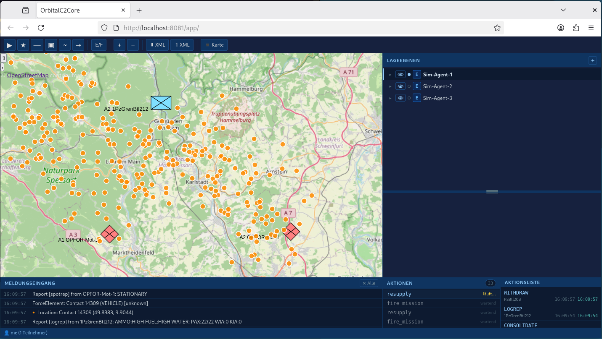

# testo2c — OrbitalC2Core Simulation Harness

Simulation and integration-test harness for [OrbitalC2Core](https://github.com/cndrbrbr/orbitalc2core).



Spins up a 3-node OrbitalC2Core cluster and attaches one simulation agent per node. Each cycle, each agent moves one of its 3 units and posts the updated position to the **other two** nodes via the Feature REST API — creating a "drop-in" effect where one new tactical symbol appears every `SIM_INTERVAL` seconds. In parallel, each agent generates a burst of randomised NATO ADP messages and injects them into the other two nodes' ADP adapters. Every injected message appears in the **Meldungseingang** (incoming message log) panel of the target node's UI; OWNSITREP and SPOTREP messages that carry coordinates are additionally shown as orange circle markers on the tactical map.

---

## Feature List

### F-01 — Three-Node OrbitalC2Core Cluster

`docker-compose.yml` brings up the full cluster with a single command, zero manual configuration:

| Service | Host port | Role |
|---------|-----------|------|
| `orbital-node1` | `:8081` | OrbitalC2Core node 1 (UI + REST API) |
| `orbital-node2` | `:8082` | OrbitalC2Core node 2 |
| `orbital-node3` | `:8083` | OrbitalC2Core node 3 |
| `adp-adapter-1` | `:9181` | ADP adapter → node 1 |
| `adp-adapter-2` | `:9182` | ADP adapter → node 2 |
| `adp-adapter-3` | `:9183` | ADP adapter → node 3 |
| `sim-agent-1` | `:9201` | Simulation agent 1 (control API) |
| `sim-agent-2` | `:9202` | Simulation agent 2 |
| `sim-agent-3` | `:9203` | Simulation agent 3 |
| `nats` | `:4222` | NATS JetStream (inter-node sync) |

- Node IDs are hardcoded deterministic UUIDs — no `.env` setup required for development.
- All three OrbitalC2Core UIs are accessible on the host immediately after `docker compose up`.
- NATS JetStream synchronises all three nodes so changes from any node propagate to the others.
- The scenario map center is pushed to all nodes at startup so all UIs open at the right area.

---

### F-02 — Simulation Agent Container per Node

Each `sim-agent-{n}` is a standalone Go binary in its own lightweight container (`Dockerfile.sim-agent`), built with `CGO_ENABLED=0`.

Configuration via environment variables:

| Variable | Default | Description |
|----------|---------|-------------|
| `AGENT_ID` | — | Agent identity: `1`, `2`, or `3` |
| `OWN_ORBITAL_URL` | — | Base URL of this agent's own orbital-node |
| `PEER_ADP_URLS` | — | Comma-separated ADP adapter URLs of the other two nodes |
| `SCENARIO` | `central-europe` | Scenario profile (see F-07) |
| `ALL_ORBITAL_URLS` | — | Comma-separated URLs of all 3 nodes (layer setup at startup) |
| `PEER_ORBITAL_URLS` | — | Comma-separated URLs of the 2 peer nodes (feature posting) |
| `SIM_INTERVAL` | `3` | Seconds between simulation cycles |
| `SIM_BURST` | `10` | Number of ADP messages generated per cycle |
| `SIM_AUTOSTART` | `true` | Start the loop automatically on container start |
| `SIM_LISTEN` | `:9200` | Control API listen address |
| `STARTUP_TIMEOUT` | `60` | Seconds to wait for dependencies before aborting |

---

### F-03 — ADP Message Generator

Each cycle generates `SIM_BURST` (default 10) ADP text messages, distributed as:

| Count | Type | Effect on map | Meldungseingang entries |
|-------|------|---------------|------------------------|
| 3 | `OWNSITREP` | Moving friendly force elements | Location (with coords ●) + ForceElement |
| 2 | `SITREP` | Situation narrative reports | Report |
| 2 | `SPOTREP` (enemy) | Red contacts at random positions | Location (with coords ●) + ForceElement + Report |
| 1 | `SPOTREP` (unknown) | Unknown contact symbol | Location (with coords ●) + Report |
| 1 | `LOGREP` | Logistics state update on a friendly unit | Report |
| 1 | `ORBAT` | Unit hierarchy (emitted every 5th cycle, otherwise replaced by extra SITREP) | ForceElements |

All generated messages are valid ADP text in the format accepted by `POST /adp/message`. Positions are expressed as WGS84 coordinates. DTGs are set to the current UTC time.

Generated ADP output is also written to the agent's structured log so messages can be replayed independently.

Each cycle therefore produces up to **~20 Meldungseingang entries** per target node (across all message types), with **~8 entries carrying coordinates** that appear as orange markers on the map.

---

### F-04 — Cross-Node Message Delivery

Each agent sends its generated messages to **both peer nodes' ADP adapters**, not to its own node:

```
sim-agent-1  →  adp-adapter-2  →  orbital-node2  →  Meldungseingang (node 2)
             →  adp-adapter-3  →  orbital-node3  →  Meldungseingang (node 3)

sim-agent-2  →  adp-adapter-1  →  orbital-node1  →  Meldungseingang (node 1)
             →  adp-adapter-3  →  orbital-node3  →  Meldungseingang (node 3)

sim-agent-3  →  adp-adapter-1  →  orbital-node1  →  Meldungseingang (node 1)
             →  adp-adapter-2  →  orbital-node2  →  Meldungseingang (node 2)
```

Delivery uses `POST /adp/message` with a JSON envelope (`{"messages": [...]}`), sending all cycle messages in one request per peer. On failure, the agent retries 3 times with exponential backoff (1 s, 2 s, 4 s). Delivery results are logged per peer per cycle.

Each transformed MIP object (ForceElement, Report, Location) is automatically appended to the target node's **Meldungseingang** panel. Location objects with WGS84 coordinates additionally appear as orange markers on that node's tactical map. The markers and log entries are independent of the Yjs-synchronised tactical feature layers — they are not replicated to other nodes.

---

### F-05 — Unit Movement Simulation and Drop-In Effect

Each agent owns 3 units (9 units total across the cluster). Each cycle, one unit is selected round-robin, moved, and posted to the two peer nodes — so exactly one tactical symbol appears or moves on the map every `SIM_INTERVAL` seconds. This "drop-in" pacing makes it easy to observe individual updates.

- Units advance along a randomly drifting bearing (±30° per cycle) by 30–100 % of the scenario's `maxSpeedM` per cycle.
- Positions are clamped to the scenario bounding box; units that would leave the box reverse bearing.
- `STRENGTH` evolves slowly (±1 per cycle, clamped 5–35) to simulate attrition and resupply.
- Feature IDs are deterministic UUIDs derived from `(agentID, unitIndex)` — the same feature is upserted on every cycle, so the map updates in-place rather than accumulating duplicates.
- At startup each agent calls `DELETE /v1/features/{id}` for all its features on all peer nodes to clear any stale state from previous runs before the new drop-in sequence begins.

---

### F-06 — Direct Orbital Feature API

Agents post tactical symbols directly to the OrbitalC2Core Feature REST API (not via ADP):

| Action | When | API call |
|--------|------|----------|
| Create simulation layer | Startup | `POST /v1/layers` on **all** 3 nodes — one `"Sim-Agent-N"` layer per agent, deterministic UUID |
| Post unit position | Each cycle | `POST /v1/features` on both peer nodes — GeoJSON `Feature` with `sidc`, `designation` |
| Set map center | Startup | `POST /v1/map/center` on own node — positions all UIs at the scenario area |
| Clear stale features | Startup | `DELETE /v1/features/{id}` on peer nodes for all owned feature IDs |
| Clean up features | `/sim/reset` | Same `DELETE` calls; also resets unit positions to scenario start |

---

### F-07 — Scenario Profiles

Built-in scenarios selected via the `SCENARIO` environment variable:

| ID | Area | Center | Bounding box | Character |
|----|------|--------|-------------|-----------|
| `central-europe` | Germany | 51.16°N 10.45°E | 47–55°N, 6–15°E | 1PzGrenBtl212 (IFV), PzBtl203 (MBT), OPFOR-Mot-1; max 2 km/cycle |
| `north-sea` | Helgoland/Kiel | 54.18°N 7.89°E | 53–56°N, 7–12°E | MarBtl1, KpFla-1 (AAA), OPFOR-Coast; max 3 km/cycle |
| `baltic` | Baltic Sea | 56.10°N 20.00°E | 54–58°N, 15–25°E | NATO-BG-1, NATO-Art-1 (SPH), OPFOR-Arm-1; max 2.5 km/cycle |
| `alpine` | Austrian Alps | 47.20°N 12.00°E | 46–48°N, 9–15°E | GebJgBtl231, Pi-Kp-5, OPFOR-Mtn-1; max 0.8 km/cycle |

All SIDCs use the 15-character APP-6B format compatible with milsymbol 2.x.

Each profile defines: bounding box, map center, unit name prefixes, echelon set, side distribution (blue/red split), and maximum movement speed per cycle.

---

### F-08 — Simulation Control REST API

Each agent exposes a lightweight HTTP API on `SIM_LISTEN` (default `:9200`):

| Method | Path | Description |
|--------|------|-------------|
| `GET` | `/sim/status` | JSON: running state, current cycle, entity counts via COP, last error, per-peer delivery stats |
| `POST` | `/sim/start` | Start (or resume) the simulation loop |
| `POST` | `/sim/stop` | Pause after the current cycle completes |
| `POST` | `/sim/step` | Run exactly one cycle immediately (regardless of `SIM_AUTOSTART`) |
| `POST` | `/sim/reset` | Stop loop, delete all agent-created features from own node, reset unit positions to scenario start |
| `GET` | `/sim/log` | Last 100 structured log entries as a JSON array |

---

### F-09 — Structured JSON Logging

Every significant event is emitted as a JSON log line to stdout:

```json
{"time":"2026-04-26T10:00:05Z","agent":1,"event":"cycle_start","cycle":7,"scenario":"central-europe"}
{"time":"2026-04-26T10:00:05Z","agent":1,"event":"message_generated","type":"OWNSITREP","serial":"007-1","unit":"1PzGrenBtl212","lat":51.234,"lon":9.876}
{"time":"2026-04-26T10:00:06Z","agent":1,"event":"delivery","peer":"adp-adapter-2","messages":10,"ok":true,"elapsed_ms":87}
{"time":"2026-04-26T10:00:06Z","agent":1,"event":"delivery","peer":"adp-adapter-3","messages":10,"ok":false,"attempt":1,"error":"connection refused"}
{"time":"2026-04-26T10:00:08Z","agent":1,"event":"delivery","peer":"adp-adapter-3","messages":10,"ok":true,"attempt":2,"elapsed_ms":134}
{"time":"2026-04-26T10:00:08Z","agent":1,"event":"cycle_done","cycle":7,"total_delivered":20,"elapsed_ms":3021}
```

All log entries are also held in a ring buffer (last 100) and served via `GET /sim/log`.

---

### F-10 — Health-Aware Startup

The agent does not start the simulation loop until all dependencies are healthy:

1. Polls `GET /healthz` on its own orbital-node every 2 s until status is `ok`.
2. Polls `GET /health` on each peer ADP adapter every 2 s until all respond `ok`.
3. If any dependency does not become healthy within `STARTUP_TIMEOUT` (default 60 s), the agent exits with code 1 and Docker Compose restarts it.

This ensures the cluster is fully ready before the first message is injected.

---

## Quick Start

```bash
# All images are available pre-built on Docker Hub (linux/amd64 + linux/arm64).
# docker compose up --build pulls them automatically — no local orbitalc2core
# checkout required unless you want to build from source.
git clone git@github.com:cndrbrbr/testo2c.git

cd testo2c
docker compose up

# Node UIs
open http://localhost:8081   # node 1
open http://localhost:8082   # node 2
open http://localhost:8083   # node 3

# Agent control APIs
curl http://localhost:9201/sim/status   # agent 1 status
curl -X POST http://localhost:9201/sim/stop   # pause agent 1
curl -X POST http://localhost:9201/sim/step   # run one cycle manually
curl -X POST http://localhost:9201/sim/reset  # clear and restart
```

Change the scenario:

```bash
# Edit docker-compose.yml: set SCENARIO=north-sea on all sim-agent services
docker compose up --build
```

Change the base maps:

```bash
# Edit basemaps.yaml — all three nodes share the same file via volume mount.
# The included basemaps.yaml ships with 8 tile sources (see below).
# Supported types: osm, xyz, wms, pmtiles, blank
docker compose up --build
```

The included `basemaps.yaml`:

```yaml
basemaps:
  - id: osm
    label: OpenStreetMap
    type: osm

  - id: esri-sat
    label: ESRI Satellit
    type: xyz
    url: "https://server.arcgisonline.com/ArcGIS/rest/services/World_Imagery/MapServer/tile/{z}/{y}/{x}"
    attribution: "© Esri"

  - id: esri-topo
    label: ESRI Topo
    type: xyz
    url: "https://server.arcgisonline.com/ArcGIS/rest/services/World_Topo_Map/MapServer/tile/{z}/{y}/{x}"
    attribution: "© Esri"

  - id: esri-relief
    label: ESRI Geländerelief
    type: xyz
    url: "https://server.arcgisonline.com/ArcGIS/rest/services/World_Shaded_Relief/MapServer/tile/{z}/{y}/{x}"
    attribution: "© Esri"

  - id: topo
    label: OpenTopoMap
    type: xyz
    url: "https://tile.opentopomap.org/{z}/{x}/{y}.png"
    attribution: "© OpenTopoMap-Mitwirkende"

  - id: carto-light
    label: Carto Hell
    type: xyz
    url: "https://a.basemaps.cartocdn.com/light_all/{z}/{x}/{y}.png"
    attribution: "© OpenStreetMap-Mitwirkende, © CartoDB"

  - id: carto-dark
    label: Carto Dunkel
    type: xyz
    url: "https://a.basemaps.cartocdn.com/dark_all/{z}/{x}/{y}.png"
    attribution: "© OpenStreetMap-Mitwirkende, © CartoDB"

  - id: blank
    label: Kein Hintergrund
    type: blank
```

---

## Project Structure

```
testo2c/
├── cmd/
│   └── sim-agent/          # Simulation agent binary entry point
│       └── main.go
├── deploy/
│   └── Dockerfile.sim-agent
├── basemaps.yaml           # Selectable base map tile sources (mounted into all nodes)
├── docker-compose.yml
└── README.md
```

The simulation agent is a self-contained Go binary. It imports `orbitalc2core/remotecontrol/client` and `orbitalc2core/messages/adp` as Go module dependencies; the `go.mod` references the sibling directory via a `replace` directive for local development and the GitHub URL for production builds.

---

## Dependencies

| Component | Source |
|-----------|--------|
| OrbitalC2Core node image | Built from `../orbitalc2core` (local); pre-built at [`cndrbrbr/orbital2core`](https://hub.docker.com/r/cndrbrbr/orbital2core) |
| ADP adapter image | Built from `../orbitalc2core/deploy/Dockerfile.adp`; pre-built at [`cndrbrbr/orbital2core-adp`](https://hub.docker.com/r/cndrbrbr/orbital2core-adp) |
| Simulation agent image | Built from `deploy/Dockerfile.sim-agent`; pre-built at [`cndrbrbr/testo2c-sim-agent`](https://hub.docker.com/r/cndrbrbr/testo2c-sim-agent) |
| NATS | `nats:2-alpine` (Docker Hub) |
| Go | 1.22+ (agent only, `CGO_ENABLED=0`) |

---

## License

Work in progress — license TBD.
